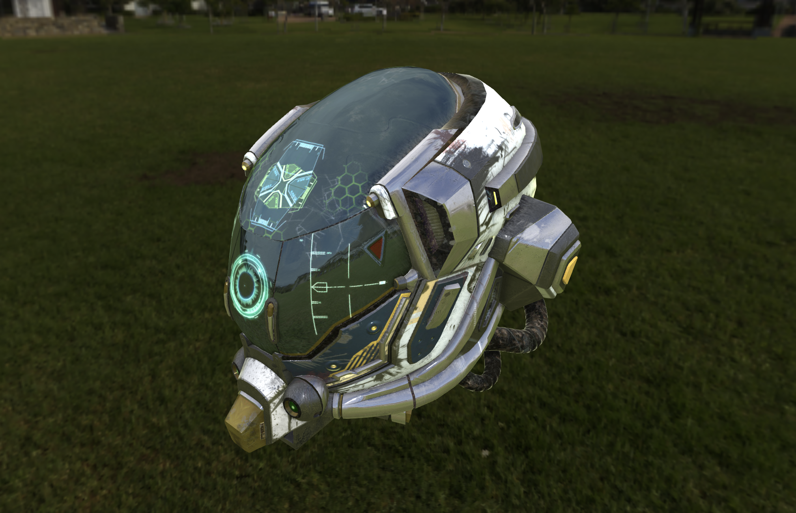

# PowerMesh

Three.jsで使えるオレオレPBRマテリアル


## Usage
### Install

1. パッケージのインストール
	```
	npm install
	```

1. サブモジュールをpull
	```
	git submodule init
	git submodule update
	```
### Run

```
npm run dev
```

## Libraries

マテリアルの品質検証のために以下のglTFモデルを利用させていただいております。

[KhronosGroup/glTF-Sample-Models](https://github.com/KhronosGroup/glTF-Sample-Models)